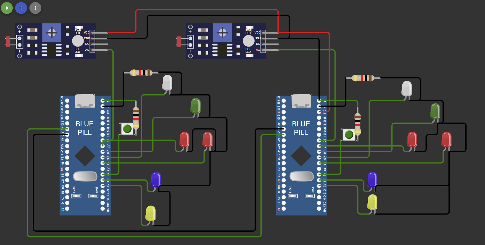

# STM32F103C6 Dual MCU Communication Project

## Overview

This project demonstrates UART communication, ADC threshold detection, timer-triggered transmissions, and external interrupt handling between two STM32F103C6 microcontrollers. The system is fully interrupt-driven and utilizes key peripherals including UART, ADC, Timers, SysTick, and GPIO.

## Features

### UART Communication (Between Two STM32F103C6 MCUs)
- **Transmit Indicator:** PA0 blinks when data is sent.
- **Receive Indicator:** PA1 blinks when data is received.
- **USART1 (PA9/PA10)** is used for UART communication.

### Timer-Based Data Transmission
- Timer triggers data transmission (values 0 to 3 cyclically) every 3 seconds.
- **Indicators:**
  - **PA4:** Displays the LSB of the transmitted data.
  - **PA7:** Displays the MSB of the transmitted data.

### Photoresistor Reading & Threshold Detection
- Reads analog input from a photoresistor connected to PB0.
- **High Threshold:** Turns ON PA5.
- **Low Threshold:** Turns OFF PA5 on the receiving MCU.

### External Interrupt Handling
- **PA2:** Configured for external interrupt input.
- On interrupt trigger via push button, a signal is sent to the other MCU.
- The second MCU toggles **PA6** in response.

## Hardware Used

- **2× STM32F103C6** microcontrollers (Blue Pill boards)
- **LEDs** (connected to GPIO pins for indication)
- **Photoresistor (LDR)** connected to PB0 for ADC input
- **Push Button** for triggering external interrupt on PA2
- **Breadboard** for prototyping
- **Jumper Wires** for connections
- **ST-Link Programmer** for flashing code

## STM32F103C6 Peripherals Used

- UART (USART1)
- ADC1 with Analog Watchdog
- General-purpose Timer (TIM2)
- SysTick Timer
- External Interrupt (EXTI2)
- GPIO (Input/Output)
- All operations are interrupt-driven

## Pin Configuration

| Pin    | Purpose                                  | Configuration                | CNF[1:0] + MODE[1:0] |
|--------|------------------------------------------|------------------------------|----------------------|
| PA0    | TX Indicator (Blink)                     | GPIO Output Push-Pull        | 0011                 |
| PA1    | RX Indicator (Blink)                     | GPIO Output Push-Pull        | 0011                 |
| PA2    | External Interrupt Input (Push Button)   | GPIO Input Pull-up/down      | 1000                 |
| PA4    | LSB Indicator of Sent Data               | GPIO Output Push-Pull        | 0011                 |
| PA5    | ADC Threshold Output                     | GPIO Output Push-Pull        | 0011                 |
| PA6    | External Interrupt Response (Toggle)     | GPIO Output Push-Pull        | 0011                 |
| PA7    | MSB Indicator of Sent Data               | GPIO Output Push-Pull        | 0011                 |
| PA9    | UART TX (USART1_TX)                      | Alternate Function Push-Pull | 1011                 |
| PA10   | UART RX (USART1_RX)                      | Input Floating               | 0100                 |
| PB0    | Photoresistor Input (ADC)                | Analog Input                 | 0000                 |

## Project Structure

### Initialization Functions

1. `void En_clock(void)`  
   Enables peripheral clocks for USART1, GPIO ports, TIM2, and ADC1.

2. `void gpio_setup(void)`  
   Configures GPIOs for UART, ADC input, external interrupts, and indicators.

3. `void systick_config(void)`  
   Configures SysTick for 1 ms tick using a 72 MHz system clock.

4. `void delay_ms(void)` and `void delay(uint32_t count)`  
   Delay utilities based on SysTick polling.

5. `void Uart1_config(void)`  
   Initializes USART1:
   - Baud Rate: 9600
   - Enables Tx, Rx, and RXNE interrupt
   - GPIO setup for PA9/PA10

6. `void ADC_config(void)`  
   Sets up ADC1 with:
   - Channel 8 (PB0)
   - Continuous conversion
   - Analog watchdog with threshold interrupts

7. `void timer_config(void)`  
   Configures TIM2:
   - Prescaler: 7200
   - Auto-reload: 50000
   - Triggers interrupt every 5 seconds

### Interrupt Handlers

- `void TIM2_IRQHandler(void)`  
  - Sends data via UART
  - Toggles PA0
  - Updates PA4 and PA7 to show LSB/MSB

- `void USART1_IRQHandler(void)`  
  - Handles received UART data
  - Updates GPIO indicators based on data

- `void ADC1_2_IRQHandler(void)`  
  - Compares ADC value to high/low thresholds
  - Sends specific character over UART depending on value range

- `void EXTI2_IRQHandler(void)`  
  - Responds to external interrupt on PA2
  - Sends a signal via UART
  - Toggles PA0

### Main Function

- `int main(void)`
  - Calls all setup functions
  - Enters an infinite loop
  - All runtime operations are interrupt-driven

## Circuit Diagram

## Build & Flash Instructions (Keil µVision 5)

1. Open the project in **Keil µVision 5** (`.uvprojx` file).
2. Set the target device to **STM32F103C6**.
3. Ensure correct startup file and system clock settings (72 MHz).
4. Build the project: **Project > Build Target** or press **F7**.
5. Connect the board using **ST-Link**.
6. Flash the firmware: **Flash > Download** or press **Ctrl + F8**.

### Tools Required

- Keil µVision 5 IDE
- STM32F1 Series Device Pack (via Keil Pack Installer)
- ST-Link USB Programmer 
- Optional: Logic analyzer or oscilloscope for UART debug

## Notes

- Use the same UART settings on both MCUs.
- Connect both boards with a common GND.
- Push button should be debounced or used with delay to avoid noise.
- ADC thresholds should match the characteristics of your photoresistor and ambient light conditions.

## License

This project is created for academic and educational purposes under the CSE 3200 course. No open-source license is currently applied.

## Author

*Syed Shifat E Rahman*
